# django-comichost

Comic hosting site using Python, Django, Docker, and PostgreSQL featuring user registration, user authentication, search, image uploads, and admin panel.

## Table of Contents

1. [About](#about)
2. [Tools](#tools)
3. [Note](#note)
4. [Screenshots](#Screenshots)
5. [Links](#links)

## About

A small functional comic hosting application built using Django. Users can create an account and depending on permissions may be restricted from viewing specific pages. Comics can be searched by name or author, and also receive reviews. Obviously, comics can have many chapters, and every chapter will have pages, which are displayed stacked on top of one another when reading. When reading the previous and next button will be active only if they exist. 

## Tools

1. [Python 3.9+](https://www.python.org/downloads)
2. [Django 4.0.10](https://www.djangoproject.com/download)
3. [PostgreSQL 13](https://www.postgresql.org)
4. [Docker 24.0.6](https://www.docker.com)
5. Deployed via [Heroku](https://dashboard.heroku.com)

## Local run

[click here](local_instruction.md) to view steps to run test enviroment locally

## Note

Some things to note about the deployment, apparently Heroku's heroku-postgresql:hobby-dev is no more :( , so obviously after these screenshots below I'll probably shut it down.

Another interesting problem I came across was the fact that despite static files working with the use of [WhiteNoise](https://pypi.org/project/whitenoise/), since heroku's dyno sleep after 30 minutes and does not preserve user uploaded media between dynos restart, I couldn't serve the images from the Comic and Pages model. I could've just used [Amazon S3](https://aws.amazon.com/s3/) service to serve the files, but I decided to be lazy and serve static files dynamically for my demo. This was easy since the example pages I have were just the chapter number, so stripping the full image.url to just the filename and dynamically putting it through the template did the job just fine.

## Screenshots

[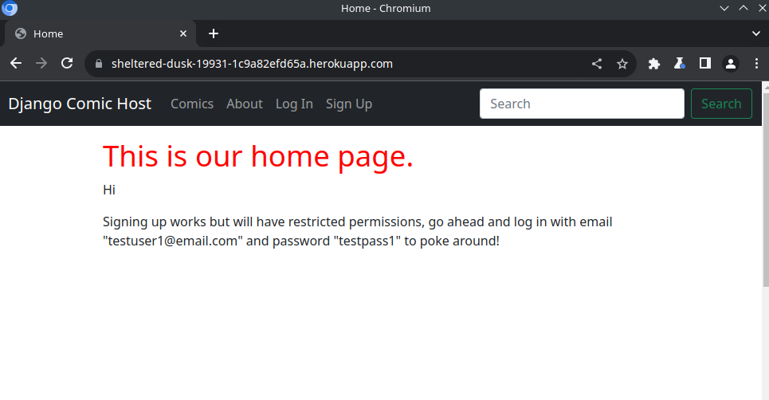](screenshots/comichost_homepage.png)

[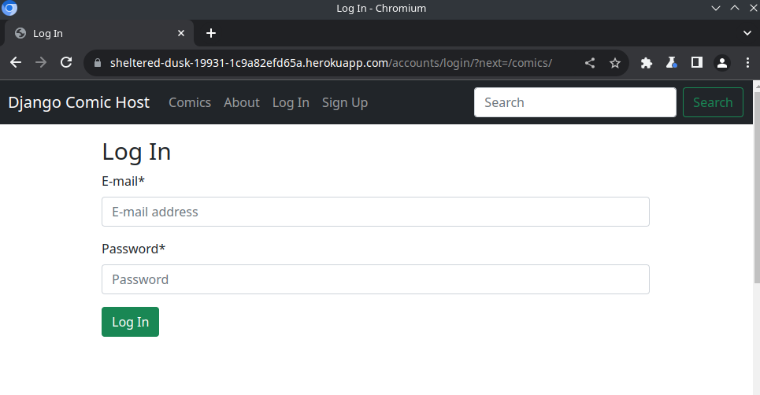](screenshots/comichost_login_page_comiclist.png)
[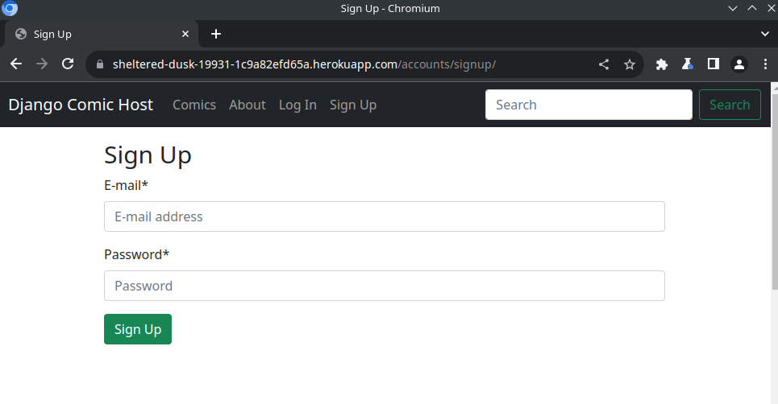](screenshots/comichost_signup_page.png)
[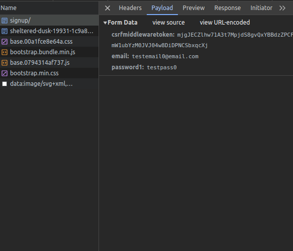](screenshots/comichost_signup_page2.png)
[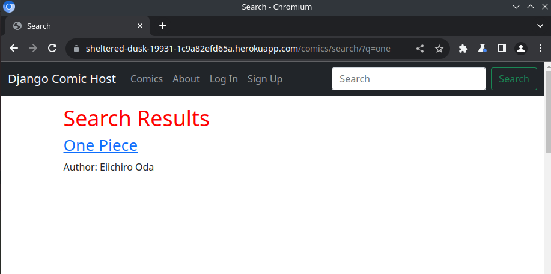](screenshots/comichost_search.png)
[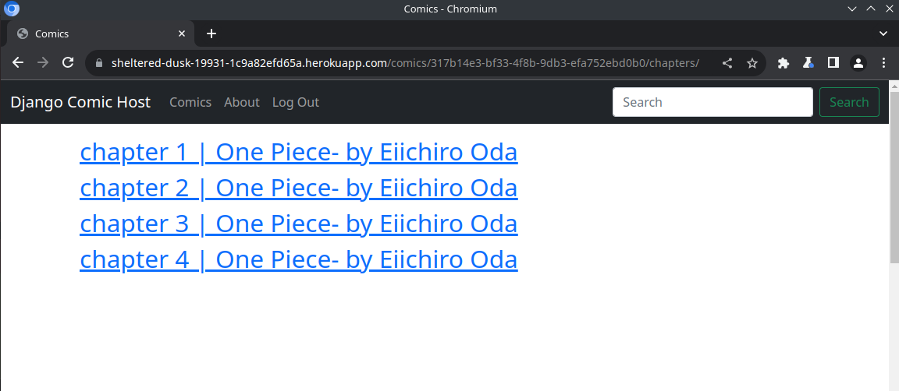](screenshots/comichost_chapterlist.png)
[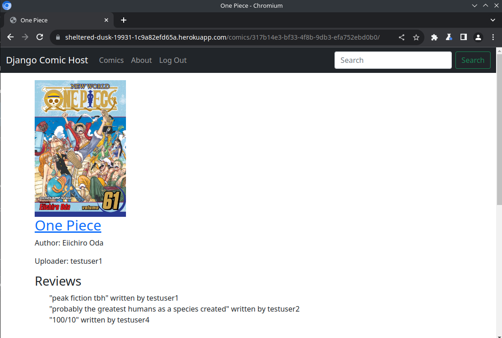](screenshots/comichost_comicdetail.png)
[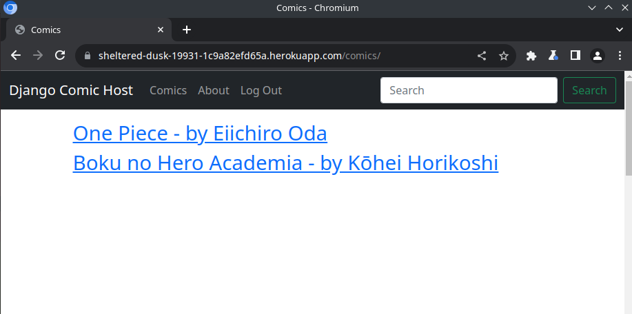](screenshots/comichost_comiclist.png)
[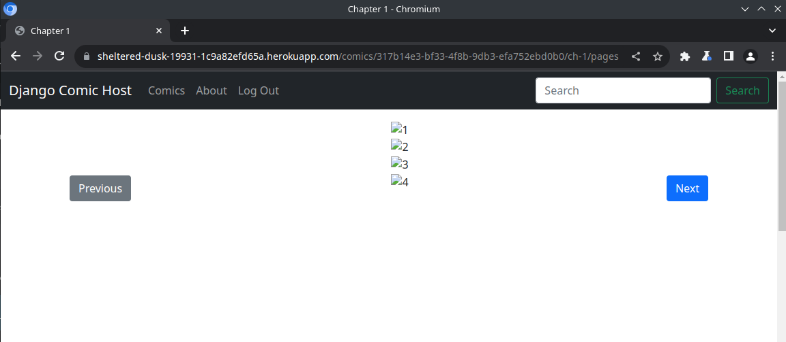](screenshots/comichost_pages.png)
[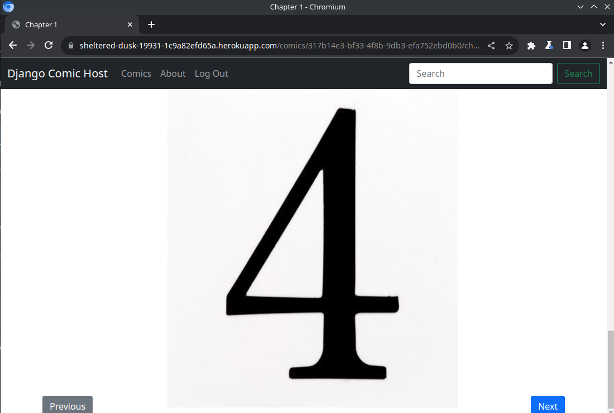](screenshots/comichost_pages2.png)
[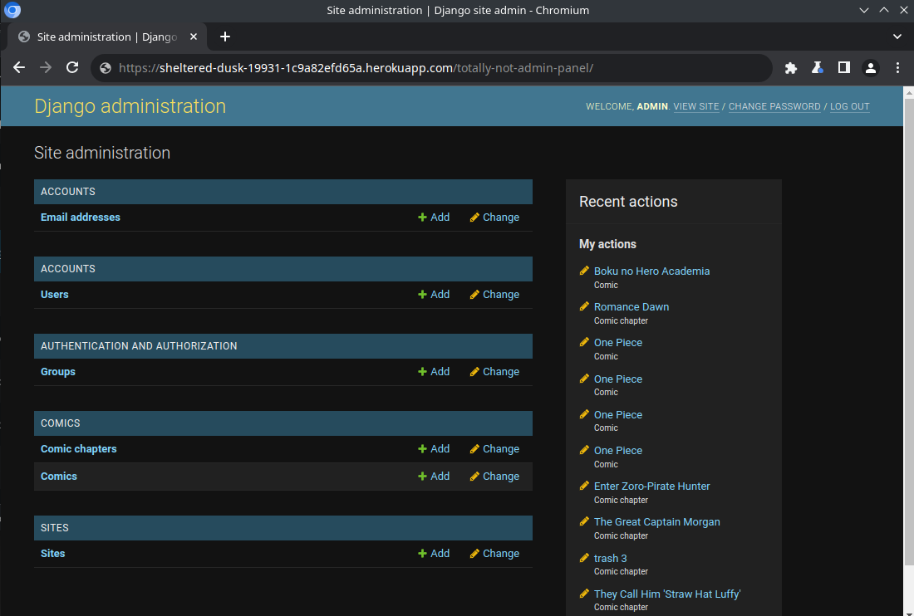](screenshots/comichost_adminpanel.png)
